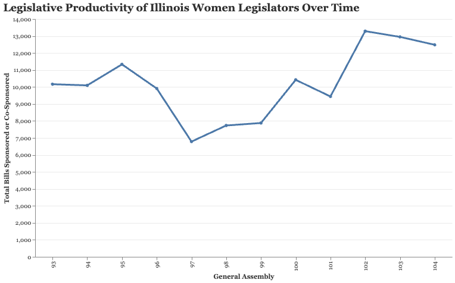
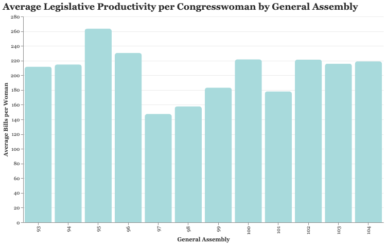
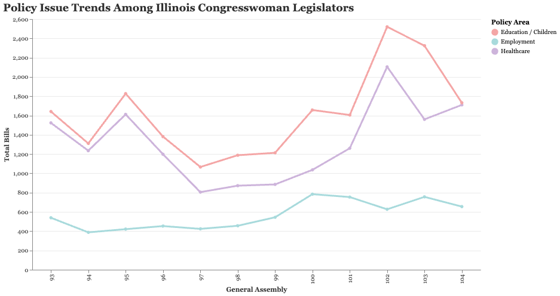

# Legislative Productivity of Illinois Women Legislators Across General Assemblies

## Project Overview

In my initial dataset, I leveraged LLMs to augment a dataset containing information on the higher education, immigration status, and stance of Illinois congresswomen. I believed that this dataset would provide useful dimensionality that could be used to understand the correlations between identity traits of policymakers that constituents may resonate with and the policies that these legislators bring about. Although I had developed a structure where the LLMs provided citations for all augmented claims along with a confidence score, I realized that these results could not be reasonably trusted as a ground truth or reliably verified when expanding a dataset from 50 rows to 500 and beyond. For that reason, I reconsidered how to develop a dataset that offers insight into the legislative productivity that female voters in the United States prioritize in a discrete manner without black-box LLM inferences.

I discovered that the Illinois General Assembly routinely releases documents that outline all the policies, whether they are House bills, Senate bills, resolutions, joint resolutions, and state constitution amendments, along with the member identification numbers of congressional members associated as primary sponsors or co-sponsors of the legislative items and a standard categorization of the item’s subject matter, such as whether it is related to healthcare, employment, education/children, etc.

I leveraged the data from these reports along with the datasets from the Center for American Women in Politics that record all the female legislators across time for each state in the United States in order to augment a dataset that highlights the legislative productivity of elected female policymakers in the Illinois General Assembly overall and also across top female voter priorities, including healthcare, employment, and children/education legislation, for each session they were elected from General Assembly 93 to 104.

Overall, this final augmented dataset accomplishes my goal of providing insight into the political influence / impact of women across history in the United States, which has been my theme of choice throughout this course on American history, with special emphasis on legislators in my home state of Illinois.

## Limitations

This dataset spans only the 93rd to the 104th General Assembly of the Illinois General Assembly and covers the bill sponsorship counts of 157 legislators across their singular or numerous terms throughout this time period within their respective chamber, both overall and in particular related to healthcare, employment, and education. Thus, this dataset does not provide insight into the entire history of legislative output of all female legislators in the Illinois General Assembly, which across time has outnumbered this 157 count, as it does not cover all General Assemblies and does not cover every female legislator. Part of this is by design, as the Illinois General Assembly has only released scrapable material from the 90th General Assembly and beyond, so the legislative work of the numerous female legislators in the state prior to 1997, the start of the 90th General Assembly, could not be covered.

Another limitation of this dataset is the depth of insight that it can offer academics and voters on the true alignment of the healthcare, employment, and education policies that the legislators sponsorsed with women’s issues. This is because it does not analyze and classify the corpora of these bills. Rather, this dataset is a means to begin shedding light on whether or not these politicians are, in fact, sponsoring bills at all within the domains that female voters highlight as their key priorities when considering their vote. It also provides discrete measures to compare their output within each of their terms and map trends in outputs overall and for these sub-domains.

Lastly, another limitation of this dataset is that it is focused on the effort of these politicians to bring about policy changes in a strong subset of the key selection issues of female voters. However, it does not measure the productivity and efficiency of these politicians in codifying these changes into Illinois law, as it does not provide insight into how many of their bills overall and in these categories actually get passed into law in the General Assembly sessions.

## Privacy and Ethical Consideration

This dataset does not conflict with many privacy and ethical considerations, as it scrapes and aggregates bill sponsorship counts on public officials. These files and information are legally made publicly available for inspection and analysis, with permissions for scraping and with the relevant sponsor member identification numbers present. Within the realm of public service and legislation, these are norms and are present for the purpose of public transparency and record keeping. This dataset keeps to those purposes by simply scraping and aggregating these sponsored bills by female Illinois General Assembly members to provide greater transparency to the public, especially female voters, on the productivity of their elected officials in domains they prioritize.

However, it can be noted that the reception of this dataset may sway individuals to view bill counts as a primary measure of a state legislator’s success, which may “flatten” the role and true impact that these legislators have on the communities that they serve. Simple policy counts cannot fully share how many individuals these policymakers impacted positively or negatively across their terms.

## How this dataset is situated in Peer Reviewed Scholarship

## Dataset Documentation

### Data Sources

As mentioned, the augmented dataset combines data from two main sources:

1. **CAWP Illinois female legislators list**
2. **Illinois General Assembly Bill Sponsorship Reports**

The CAWP dataset was the baseline that identified 157 female Illinois General Assembly members of interest across 12 General Assembly sessions spanning from the 93rd General Assembly to the 104th, which accounts for 24 years, as each General Assembly spans a two-year period for which an official is elected. These legislators were matched to bills they were associated with from scraped ILGA (Illinois General Assembly) reports by their unique member identification number.

### Row Analysis

Each row covers the legislator’s activity across the determined categories for each specific General Assembly session that they were elected for. This structure was chosen over simply creating a row that aggregates the legislator’s productivity over their entire political career, regardless of session count, because it enables greater insight into metrics that voters care about, such as how active a policymaker is within any given session or their latest session before voters cast ballots for the upcoming session. It also provides greater insight into metrics that researchers regard, such as trends across time in the productivity of each legislator, enabling comparative research between other female legislators in Illinois and beyond, as well as analysis between them and their male legislator colleagues, predecessors, or successors.

### Final Dataset Attributes

The final dataset contains:

- **596 rows**
- **157 unique female legislators**
- **General Assemblies 93 through 104**
- **122,474 total bill sponsorship or co-sponsorship records counted**
- **28,191 primary sponsorship records**
- **94,283 co-sponsorship records**

Across the three selected issue areas, the final dataset counted:

- **15,801 healthcare-related bill records**
- **6,801 employment-related bill records**
- **19,464 education/children-related bill records**

### Columns

The final dataset includes the following major columns:

- `ID`: CAWP identifier for each female legislator
- `cawp_name`: Name of the legislator from the CAWP dataset
- `ilga_name`: Name of the legislator as matched in ILGA sponsor reports
- `chamber`: Denoting whether the legislator was within the House or Senate for that General Assembly
- `general_assembly`: Which General Assembly the legislator was active in
- `ilga_all_bills_count`: Total House Bill / Senate Bill sponsorship and co-sponsorship count of the legislator within the given General Assembly session
- `ilga_primary_bills_count`: Count of bills where the legislator was the primary sponsor
- `ilga_cosponsored_bills_count`: Count of bills where the legislator was a co-sponsor
- `ilga_healthcare_all_count`: Healthcare-related bill count that the legislator was associated with
- `ilga_employment_all_count`: Employment-related bill count that the legislator was associated with
- `ilga_education_children_all_count`: Education/children-related bill count that the legislator was associated with

## Methodology

My initial approach to this final dataset was to scrape the current ILGA (Illinois General Assembly) member pages and match bills found on those pages to Illinois female legislators from the CAWP dataset. This worked for the current legislators, but it was only able to capture 70 female legislators. The main issue was that these pages did not provide insight into the historical membership of the ILGA. Additionally, the subsequent scraper for aggregating the counts of legislation these legislators were associated with was not able to discern which General Assembly they were filed in, resulting in each row for the lawmaker having the values of the bill counts for each General Assembly they were elected for hosting the count from their current session.

As a result of these mismatches in data needs in the final dataset development, I utilized the following strategy:

I scraped ILGA Sponsor Bill Listing reports rather than ILGA member pages. Here, I parsed the reports and matched sponsor (legislator) names/identification to those from the original CAWP dataset, which included only female legislators from the Illinois General Assembly, and then aggregated the bills that these legislators were referenced by, relevant female legislator, chamber, and the General Assembly session. I then filtered to ensure that only House and Senate Bills were considered, as otherwise greater noise would be introduced to the dataset due to the high volume of legislative items that are not associated with public policies that these representatives are often tied to through resolutions and other memorandums. This also ensured that the dataset’s definition of “bill sponsorship” aligned with its general interpretation by voters and academics.

## The Role of Computation

Computation was integral to developing a reliable dataset at this scale. The following computational processes were used to develop the final augmented dataset:

- scraping ILGA sponsor reports
- parsing sponsor names, bill numbers, bill titles, and sponsorship types
- using fuzzy matching to connect CAWP women to ILGA sponsor records
- classifying bill short titles into issue categories using discrete keyword rules provided by the Illinois General Assembly documentation
- aggregating bill-level records into woman-General Assembly rows
- creating visualizations with Altair to identify patterns in legislative productivity of female elected policymakers over time

Through this computational process, I learned that scraping as a means to collect data can only be properly done when there is thorough inspection and attention paid to the structure of the underlying documents. This is to ensure that, across these vast periods of time, the cultural data continue to enable the consistent standardization needed for the dataset’s use cases. If the document structures changed or no longer consistently provided certain pieces of information, it would directly impact the integrity of the dataset. This made me realize the significant challenge to working with cultural documents/artifacts with computation that may not be seen when working with other types of data.

## Findings with Visualizations

Here are a few of the visualizations that overviewed the findings of this scraped dataset. There are additional visualizations that summarize findings on the productivity of female legislators within and between both chambers throughout sessions within the submitted Python notebook.

### Legislative Productivity Over Time

The dataset showcased that overall legislative productivity of female legislators in the Illinois General Assembly has fluctuated across time, with more recent sessions boosting high outputs while there were dramatic dips around session 97. This could be for various reasons, such as fewer female legislators having been elected during the time, strong opposition to legislation led and co-led by female legislators, or simply an unproductive legislative time period.

### Average Legislative Productivity

When considering the average legislative productivity over the aggregate we can still see the trend that General Assemblies 97 to 99 were periods with significantly lower productivity.

The overall productivity chart shows that total sponsorship and co-sponsorship activity fluctuated across General Assemblies. Activity dipped around GA 97, then rose again in later sessions, reaching especially high levels around GA 102 and remaining high through GA 104.

These insights can begin shaping future academic research into legislative behaviors of female legislators across various time periods and political environments.

### Policy Issue Trends

This policy trend visualization compared the counts of bills sponsored on healthcare, employment, and education/children across the sessions by the legislators. We can see that education/children and healthcare bill counts follow a similar trend to the overall policies sponsored and that employment remains the category with the fewest policies sponsored across time.

## Overall Dataset Insights

As expressed by the visualization of the prior summarizations of the dataset we see there are a few noteworthy trends that the data work reveals. First it shows that female legislators in Illinois were associated with a notably high volume of bills across the sessions studied. There were over 122,000 sponsorships and co-sponsorships within the under 30 year period from the 157 matched legislators.

Co-sponsorships made up a significant portion of this legislative productivity. Which adds insights into the collaborative nature of these legislators. We also saw that some of the top policy priorities of female voters that we filtered for did reflect within the output of these legislators as these categories combined many times make up over 20-30% of bills that these legislators sponsored in a given session.

All of these trends can be utilized in further peer reviewed studies to find out whether male colleagues in the General Assembly exhibit similar or diverging behaviors. Further research could also explore more into how the leadership roles these legislators hold within Congress, their seniority, the current party control, and chamber affiliation affects the legislative output of female legislators.

## Reflection: Culture as Data

Through this project, I learned that when it comes to working with cultural data, the technical skill of implementing computational strategies often becomes the easiest part. The most difficult part is the ethical data sourcing and ensuring that the research questions in mind can be answered with integrity by the artifacts that are found. Another challenge is ensuring that the data generated from scraping and aggregating from multiple sources are accurately conveyed to ensure that the data can be meaningfully used for academic research or analysis.

The scale of the dataset also adds pressure as the possible positive and negative implications of having reliable dataset compounds.

Overall, I learned that transparency and discrete methods are important when it comes with working with cultural data which affirms my choice to grow away from using blackbox LLMs for this and future projects of this kind.
